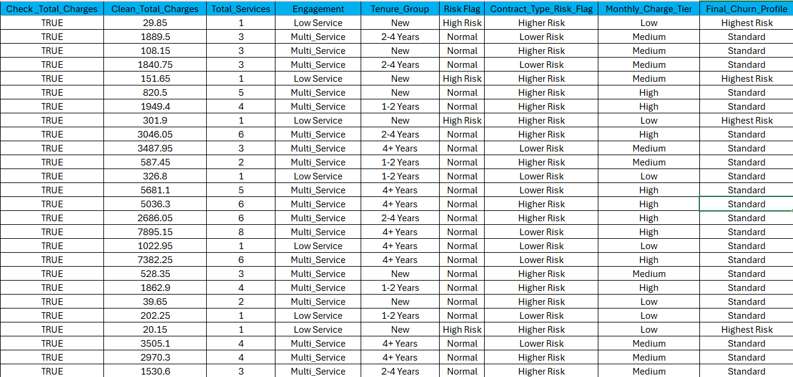
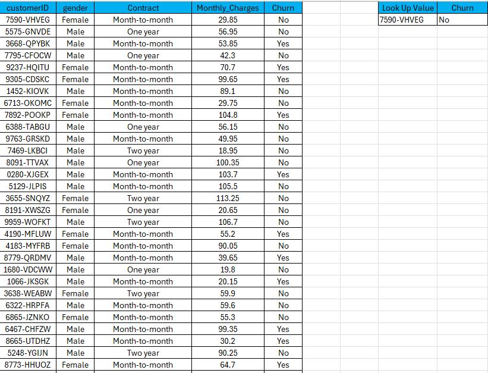

# Customer Churn Analysis – Excel Project

This Excel-based learning project simulates the work of a Customer Success or Operations Analyst may do when looking into customer churn. It uses logic-driven formulas to flag at-risk customers based on tenure, service engagement, and total charges. It also includes a customer ID lookup tool for fast insights.

---
## Business Objective

This project simulates a scenario where a Customer Success Analyst is asked:

> “Can you help us identify which customers are most likely to churn based on what we already know?”

The Excel workbook answers this by using logical segmentation to flag high-risk customers and provide fast lookup access for Success Managers.

---

## Workbook Preview

1. **Final Churn Profile Table**  
  
> Segments customers by tenure, service level, and other risk flags.

2. **Lookup Tool**  
  
> Lets Customer Success Managers search by ID and review churn factors.

---

## What This Workbook Shows

- Validates total charges using `ISNUMBER()` and `IFERROR()`  
- Segments customers by:
  - **Tenure Group** (New, 1–2 Years, 2–4 Years, 4+ Years)  
  - **Service Level** (Low Service vs. Multi-Service)  
  - **Risk Flag** (High Risk if new & low service)  
- Adds secondary risk factors:
  - **Monthly Charge Tier** (High / Medium / Low)  
  - **Contract Type Risk** (e.g., Month-to-Month = Higher Risk)  
- Combines all factors into a **Final Churn Profile**  
- Includes a searchable lookup tool using `XLOOKUP()`  
- Uses `TEXT()`, `IF()`, `AND()`, and `OR()` for formatting and flag logic

---

## Why This Matters

This type of analysis reflects the day-to-day work of Customer Success Operations Analysts:

- Identifying at-risk customers using defined business logic  
- Helping Customer Success Managers act quickly using filters and flag systems  
- Reducing churn with structured, proactive segmentation and insights

---
## Insight & Business Value

This workbook mirrors real Excel-based analysis used by Customer Success and Operations teams:

- **Retention Targeting** – Flags new, low-engagement customers with high churn risk  
- **CSM Enablement** – Provides a fast, filterable lookup tool for customer profiles  
- **Decision Support** – Combines multiple logic points into a churn profile to guide proactive renewal strategy  

> This mirrors the type of segmentation often used by CS teams in tools like Gainsight or Salesforce—especially when predictive models aren’t available.

---

## Formula Logic Documentation

- `ISNUMBER()` – Validates numeric values  
- `IFERROR()` – Prevents formula errors  
- `COUNTIF()` – Counts engaged services  
- `IF()`, `AND()`, `OR()` – Used for churn risk logic  
- `XLOOKUP()` – Powers the customer lookup tool  

> Formula logic and churn segmentation views are included as screenshots in `/images/`.

---

## File Structure

| Sheet Name                      | Description                                                |
|----------------------------------|------------------------------------------------------------|
| `Customer Churn Project Table`   | Main dataset with derived columns and churn segmentation   |
| `Formulas used in Project Table` | Step-by-step formula logic explanations                    |
| `Customer Churn Look Up Tool`    | ID-based search tool using `XLOOKUP()`                     |
| `Formulas Used in Look Up Tool`  | Supporting logic for the lookup tab                        |

---

## Created By

**Aaron Zeug**  
Aspiring Data Analyst with CX + Ops background  
[GitHub Profile](https://github.com/Gray135) • [LinkedIn](https://www.linkedin.com/in/aaronzeug)

Open to CX Ops, Data Analyst, or Insights roles where Excel-based decision tools are still part of the workflow.
